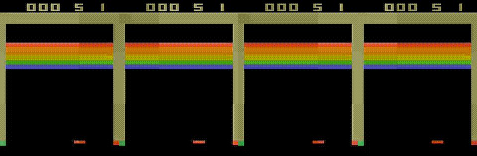
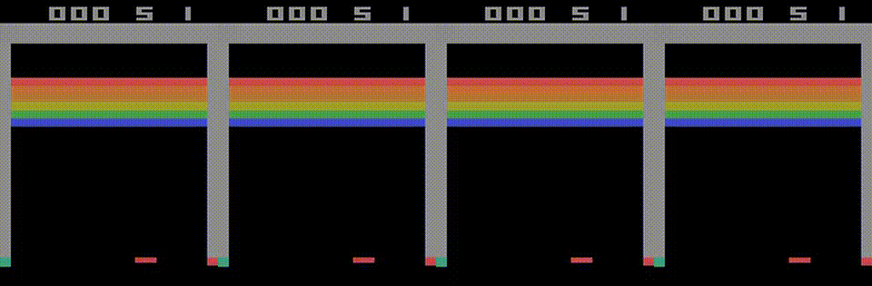

# Breakout DQN

### Teaching a neural network to play Atari Breakout from raw pixels — no rules, no hints, just a reward signal.

> 🇪🇸 [Versión en español](README.es.md)

  

---



**That's the same agent at episodes 0, 2000, 5000 and 9000.** Nobody told it what a ball is, what the paddle does, or that bricks are worth points. It only ever saw the pixels and a number going up when it scored. By episode 9000 it had figured out the tunnel strategy on its own — the same trick the original DeepMind paper made famous.

## What it actually does

A **reinforcement learning agent** is a program that decides what to do, sees what happened, and adjusts — the same loop you use the first time you pick up a controller for a game you've never played.

At every frame this one looks at the screen and picks one of four moves: stay, fire the ball, left, right. It gets a tiny reward for each brick it breaks, and that is the *only* feedback it ever receives. The rules of Breakout, the existence of a ball, the idea that the paddle is good — all of that it has to discover by playing.

"Training" here means letting it play for millions of frames while a convolutional neural network slowly learns to estimate, straight from the pixels, how good each action is in each situation. The first few hundred episodes look exactly like a random number generator holding a joystick. A few thousand episodes later, it's deliberately aiming for the corner.

## What's in here

- **Vanilla DQN** — the 2015 Nature baseline ([Mnih et al.](https://www.nature.com/articles/nature14236))
- **Double DQN** — the 2016 fix for Q-value overestimation ([van Hasselt et al.](https://arxiv.org/abs/1509.06461))
- **Full Atari preprocessing pipeline** — grayscale, 84×84 resize, 4-frame stacking, reward clipping, ε-greedy annealing
- **Trained checkpoints** — run the agent in 30 seconds, no training required
- **Side-by-side progression GIFs** for both agents
- **Reproducible** — conda env, pip requirements, single-command train and eval, optional Weights & Biases logging

## See the other one too

**Vanilla DQN**



## Try it in 30 seconds

```bash
conda env create -f environment.yml
conda activate breakout-dqn

python scripts/evaluate.py \
    --checkpoint checkpoints/double_dqn_final.dat \
    --episodes 5 --render
```

`pip install -r requirements.txt` works too if you don't use conda.

## Train your own

```bash
python scripts/train.py \
    --agent double_dqn \
    --episodes 10000 \
    --video-dir videos/run1 --record-every 500 \
    --wandb
```

Knobs you'll probably touch: `--agent {dqn,double_dqn}`, `--lr`, `--gamma`, `--epsilon-anneal-steps`, `--sync-target`. Full list in `python scripts/train.py --help`.

Regenerating the progression GIFs:

```bash
python scripts/make_gifs.py \
    --run videos/ddqn_training \
    --out assets/double_dqn_progression.gif \
    --episodes 0 2000 5000 9000
```

## Under the hood

1. **Preprocessing** — frames are converted to grayscale, resized to 84×84, and the last 4 are stacked so the network can perceive motion. Rewards are clipped to `{-1, 0, +1}`.
2. **Network** — a small CNN (two conv layers + one fully-connected) outputs a Q-value per action.
3. **Experience replay** — transitions `(s, a, r, done, s')` are stored in a circular buffer; minibatches are sampled at random so training isn't biased by consecutive in-game moments.
4. **ε-greedy exploration** — ε is annealed linearly from 1.0 → 0.1 over the first million environment steps, so the agent explores aggressively at first and trusts what it has learned later on.
5. **Target network (Double DQN)** — a frozen copy of the online network evaluates the next-state Q-value while the online network chooses *which* action to evaluate. Splitting those two roles is what kills the systematic overestimation bias of vanilla DQN.

## Project structure

```
src/         # agents, CNN, replay buffer, env wrappers
scripts/     # train.py, evaluate.py, make_gifs.py
notebooks/   # train_and_evaluate.ipynb walkthrough
checkpoints/ # trained .dat weights
assets/      # README GIFs
```

## References

- Mnih et al., *Human-level control through deep reinforcement learning*, Nature 2015.
- van Hasselt, Guez, Silver, *Deep Reinforcement Learning with Double Q-learning*, AAAI 2016.
- [Gymnasium](https://gymnasium.farama.org/) for the Atari environment, [PyTorch](https://pytorch.org/) for the network.

## Author

**Bruno Dinello** — [GitHub](https://github.com/brunodinello) · [LinkedIn](https://www.linkedin.com/in/bruno-dinello)
**Carlos Dutra Da Silveira**
**Loernzo Foderé**

## License

MIT — see [LICENSE](LICENSE).
